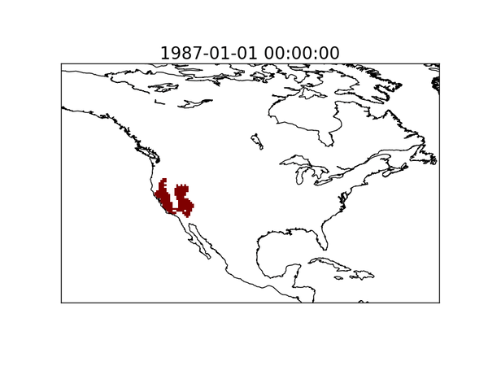

# Identifying and tracking droughts through space and time

## Summary
The code in this repository can be used to identify and track drought clusters from monthly data, allowing the user to study the characteristics and behaviors of droughts in space and time within a given region or globally. This code is intended to be use for analyzing gridded datasets (e.g. reanalyses, climate model outputs) and not over point-observations. 

The code is found under the `src` directory and contains the following files:
- `definitions.yaml`: This YAML file contains all the definitions, parameters, and paths needed to run the `02_calculate_drought_clusters_parallel.py` and `03_process_drought_clusters.py` scripts. The user will need edit this file, at least to add the paths where the drought metric data is saved and where the drought cluster files will be saved.
- `01_data_preprocessing.py`: This code can be used to understand the type of data pre-processing needed prior to using the clustering algorithm.
- `02_calculate_drought_clusters_parallel.py`: This code contains the workflow to calculate droughts clusters for a given time slice. The code loops through the time steps given by the user and is set up to run in prallel using the `mpi4py` library. However, the code can be easily modified by the user to run in series (i.e. no parallelization) or to implement the parallelization using a different library.
- `03_process_drought_clusters.py`: After the 2D drought clusters have been identified for each individual time step in the time period of interest, the use can run this code to link the drought 2D drought clusters through time. 
- `drought_clusters_utils.py`: This file contains all the necessary functions used to identify and track the drought clusters. 

For further information on the algorithm, please read the references provided in the **How to cite this code** and **References** sections.

The following animation shows an example of a drought cluster identified using soil moisture data from NCEP's Climate Forecast System Reanalysis (CFSR) (Herrera-Estrada et al., 2017):

  

## Requirements
The code has been optimized to work with Python 2.7 and requires the following Python libraries:
- `numpy==1.18.5`
- `netCDF4==1.5.3`
- `python-dateutil==2.8.1`
- `mpi4py==3.0.0`*

*This library is needed for the parallelization of the cluster code in `02_calculate_drought_clusters_parallel.py` and may require additional dependencies. Further, a different parallelization method can also be implemented using a different library.

## 1. Data pre-processing
Prior to identifying and tracking drought clusters using this code, the user needs to create a NetCDF file that contains a 3D array (time, lat, lon) that contains the gridded, normalized drought metric to use. Further, the longitudinal coordinates must be given in the form (-180, 180) instead of (0, 360). 

The clustering code in this repository was initially written to analyze percentiles of soil moisture in Herrera-Estrada et al. (2017) and later used to analyze percentiles of 12-month cumulative anomalies of precipitation-minus-evaporation in Herrera-Estrada and Diffenbaugh, *under review*.

The `01_data_preprocessing.py` provides an example of how the user may calculate percentiles of cumulative anomalies of precipitation minus evaporation using sample data from the Modern-Era Retrospective Analysis for Research and Applications version 2 (MERRA2), a reanalysis dataset produced by NASA. This script assumes that user has saved separate NetCDF files with the precipitation and evaporation from the reanalysis. The user will need to pass on the paths where these files are saved.

The user can apply this clustering algorithm to other reanalysies datasets (e.g. ECMWF's ERA5), as well as climate model simulations (e.g. CMIP6). Further, the user can also identify and track drought clusters based on more traditional drought indices such as SPI, PDSI, and SPEI so long as they are provided as a gridded product. Note that the user may need to make slight adjustments to the names of the variables in the NetCDF file with the drought metric to make sure the coordinates and the metric are loaded correctly.

## 2. Identifying drought clusters in 2D
Once the user has created the NetCDF file with the 3D array (time, lat, lon) containing the gridded and normalized drought metric, the user can run the `02_calculate_drought_clusters_parallel.py` file to identify the 2D drought clusters in every time step (we will join the drought clusters through time in the next step). This file has been designed to run in parallel using the `mpi4py` Python library, so the user must make sure that they have this library and required dependencies installed.

To run this file on 4 processors, the user would time the following into the command line:
`mpirun -np 4 python 02_caculate_drought_clusters_parallel.py`

The maximum number of processors that the user can use will be dictated by the processors available to the user in their computer or computer cluster.

The code in `02_caculate_drought_clusters_parallel.py` will carry out the following operations for each time step:
1. Extract the 2D array for the given time step
2. Apply a median filter over the 2D array to smooth out noise
3. Apply drougth threshold definition. As mentioned previously, this code was written to work with percentiles (e.g. of soil moisture) so a drought is definied by a percentile threshold (e.g. 20th percentile). If a user were to use this code on drought metrics such as SPI, PDSI, or SPEI, they will need to set the drought definition specific to those metrics (e.g. 0 for any negative anomaly or -1 to focus on more severe droughts). Since the drought clusters are identified in 2D first and connected later, the user is encouraged to pick a less strict drought definition at this stage (e.g. 20th percentile when using percentiles or -0.5 when using SPI, PDSI or SPEI) to improve the temporal connectivity of the drought clusters, in case there is some intermitent recovery of drought conditions.
4. Identify all the 2D drougth clusters for that time step. If the user intends to calculate drought clusters that may cross the right/left boundaries of the map, then they must set the Boolean variable `periodic_bool` to `True`. This will make sure the clustering algorithm links clusters along that cross the right/left boundary. Otherwise, if the user is doing a regional analysis, they must set `periodic_bool` to `False`.
5. Filter drought clusters by area and if the centroid lies within the Sahara Desert. The pevious step will include single grid cells that meet the drought definition as an individual cluster. To make the code more efficient, the user can set a minimum area threshold using the `area_threshold` variable so as not to include clusters that are too small. 
6. Save the drought clusters for the current time step. Three files will be saved:
	- `cluster-matrix_' + str(current_date) + '.pck`: A pickled file with a 2D NumPy array of the same dimensions as the initial 2D array but where all the grid cells not belonging to a drought cluster are masked out.
	- `cluster-dictionary_' + str(current_date) + '.pck`: A pickled file with the dicionary for the current time step containing all the characteristics of the 2D drought clusters identified.
	- `cluster-count_' + str(current_date) + '.pck`: A pickled file with the number (integer) of drought clusters identified in the current time step.
(The `current_data` variable is of the type `datetime` and will be needed in the following step to combine all the 2D drought clusters calculated for each time step individually in parallel.)

## 3. Tracking drought clusters through time
Once the drought clusters have been identified for every time step, the user can run the `03_process_drought_clusters.py` script. This script will create two outputs:
- `drought_clusters_' + dataset + '_' + drought_threshold + '_' + str(start_date.year) + '-' + str(end_date.year) + '.nc`: A NetCDF file with the 3D array (time, lat, lon) of all the drought clusters identified. The variables in the name can be modified by the user according to their needs.
- `tracked_clusters_dictionary_' + str(start_date.year) + '-' + str(end_date.year) + '.pck`: A pickled file containing the dictionary with the characteristics of all the drought clusters tracked through time.

The structure of the `tracked_clusters_dictionary_' + str(start_date.year) + '-' + str(end_date.year) + '.pck` is as follows:
- `cluster_data_dictionary[cluster_ID]['start']`: Datetime object with the start date of the cluster identified by `cluster_ID` (where `cluster_ID` is an integer)
- `cluster_data_dictionary[cluster_ID]['end']`: Datetime object with the end date of the cluster identified by `cluster_ID`
- `cluster_data_dictionary[cluster_ID]['parent_of']`: List with the IDs of clusters that resulted from this cluster (e.g. if this cluster split into 2+ clusters)
- `cluster_data_dictionary[cluster_ID_count]['child_of']`: List with the IDs of clusters that produced this cluster (e.g. if a cluster split into 2+ clusters or 2+ clusters merged into the current one)
- `cluster_data_dictionary[cluster_ID]['splitting_events']`: List of indices corresponding to the array `range(0, nsteps)` recording all the times that this cluster split into 2+ clusters
- `cluster_data_dictionary[cluster_ID]['splitting_events_by_date']`: List of datetime objects recording the instances when this cluster split into 2+ clusters
- `cluster_data_dictionary[cluster_ID]['merging_events']` = List of indices corresponding to the array `range(0, nsteps)` recording the instances when this cluster merged with another cluster
- `cluster_data_dictionary[cluster_ID_count]['merging_events_by_date']`: List of datetime objects recording the instances when this cluster merged with another cluster

Further, each `cluster_data_dictionary[cluster_ID]` entry also includes keys of datetime objects corresponding the the dates when this cluster existed. These datetime keys 'unlock' a dicionary that contains the characteristics of the drought cluster at that point in time. For example, for a date `current_date`, the structure of ththe dictionary with the characteristics is as follows: 
- `cluster_data_dictionary[cluster_ID][current_date]['area']`: Float number of the area of the drought cluster in km^2
- `cluster_data_dictionary[cluster_ID][current_date]['intensity']`: Float number of the mean intensity-related metric given by the mean of `1-percentiles` over the grid cells corresponding to the drought cluster
- `cluster_data_dictionary[cluster_ID][current_date]['centroid']`: Tuple of the form (longitude, latitude) describing the position of the cluster centroid
- `cluster_data_dictionary[cluster_ID][current_date]['coordinates']`: List of tuples of the form `(index_latitude, index_longitude)` for all the grid cells belonging to the drought cluster. Note that these are not actual latitude and longitude coordinates, but the corresponding indices within the 2D array used to calculate the drought clusters. For example, if the initial input 2D array was of dimension (200, 400), then `index_latitude` will range from `[0, 199]` and `index_longitude` will range from `[0, 399]`. The actual latitudes and longitudes can be calculated easily and quickly using these indices and the 1D arrays of latitudes and longitudes from the initial NetCDF file.

## How to cite this code
This code was written by Julio E. Herrera Estrada, PhD.

To cite the use of this code, please use the following reference:
- Herrera-Estrada, J. E., Satoh, Y., & Sheffield, J. (2017). Spatiotemporal dynamics of global drought. *Geophysical Research Letters*, **44**, 2254–2263. https://doi.org/10.1002/2016GL071768

## References of articles that have used this code
- Herrera-Estrada, J. E., Satoh, Y., & Sheffield, J. (2017). Spatiotemporal dynamics of global drought. *Geophysical Research Letters*, **44**, 2254–2263. https://doi.org/10.1002/2016GL071768
- Herrera-Estrada, J. E. and Diffenbaugh, N. S. Landfalling Droughts: Global tracking of moisture deficits from the oceans onto land. *Water Resources Research, under review*

## Questions and ideas
I will do my best to reply to any questions that users may have on how to use this code, as well as develop further releases with improvements and expanded functionallity. If you have any questions or ideas, or would like to collaborate in the development of this code or studies based on it, please contact me (Julio) at `jherrera at alumni dot princeton dot edu`. 

However, please also note that I provide no guarantee for ongoing support and further releases at this time, so all further work answering questions or improving this code is done voluntarily.  
